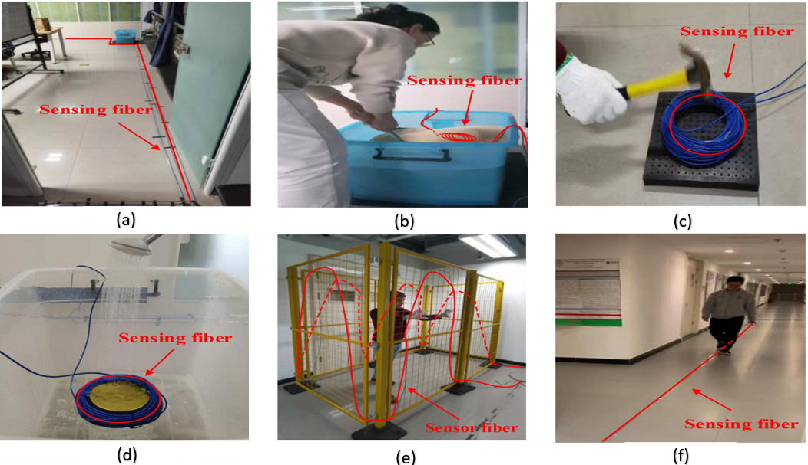
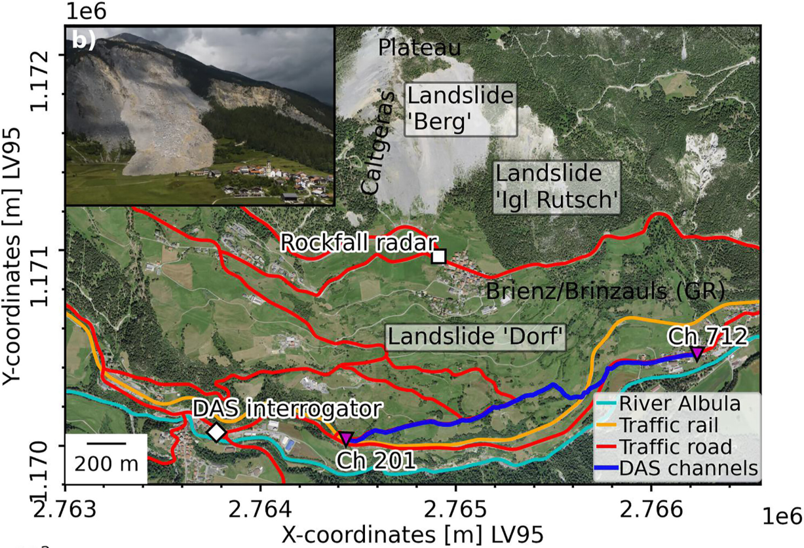
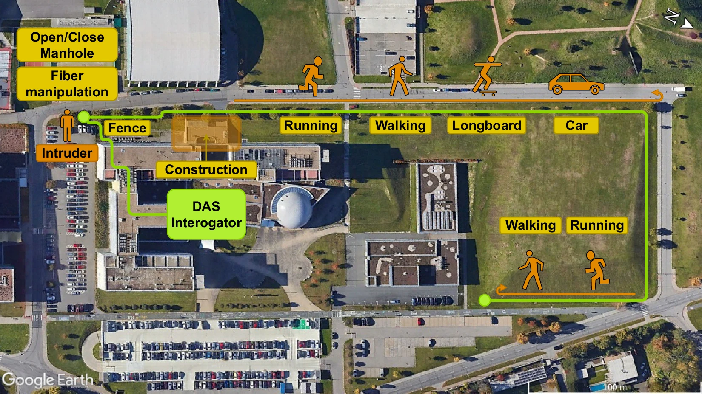

# Dataset Description

This repository relies on three datasets used for evaluating the proposed models.  
Due to anonymity and data sharing restrictions, the datasets are **not included** in this repository.

Below are the links and references to access each dataset.

---

## 1. φ-OTDR Laboratory Dataset

This dataset is widely used for benchmarking DAS-based event classification.

### Description

- 6 classes:
  - (a) background
  - (b) digging
  - (c) knocking
  - (d) watering
  - (e) shaking
  - (f) walking

- Train/test spliting :
  
| Event      | Number | Label | Train | Test |
|------------|--------|-------|-------|------|
| Background | 3094   | 0     | 2505  | 589  |
| Digging    | 2512   | 1     | 2018  | 494  |
| Knocking   | 2530   | 2     | 2025  | 505  |
| Watering   | 2298   | 3     | 1853  | 445  |
| Shaking    | 2728   | 4     | 2183  | 545  |
| Walking    | 2450   | 5     | 1969  | 481  |
| **Total**  | **15612** | -- | **12553** | **3059** |

### Access
The dataset is publicly available and can typically be accessed via the original publication or associated repositories.

### Reference

- Cao, X., et al.  
  *An open dataset of φ-OTDR events with two classification models as baselines*  
  IEEE Sensors Journal

---

## 2. Geophysical DAS Dataset (Rock Slope Failure Monitoring)

This dataset is used for geophysical monitoring tasks.

### Description

- DAS signals recorded for rock slope failure detection
- Multi-class classification depending on setup
- High spatial resolution along fiber

- 3 classes:
 - Vehicle noise 
 - Slope failure
 - Narrow-band noise
  
- Train/test splitting :

| Event             | Number | Label | Train | Test |
|-------------------|--------|-------|-------|------|
| Vehicle noise     | 792    | 0     | 633   | 159  |
| Slope failure     | 384    | 1     | 307   | 77   |
| Narrow-band noise | 191    | 2     | 153   | 38   |
| **Total**         | **1367** | --  | **1093** | **274** |

### Access

The dataset is available through the following repository:

- https://www.envidat.ch/#/metadata/distributed-acoustic-sensing-brienz

(Search for the dataset associated with the reference below)

### Reference

- Jiahui Kang et al. 

    Kang, J., et al. (2024).
    *Automatic monitoring of rock‐slope failures using Distributed Acoustic Sensing and semi‐supervised learning*
    Geophysical Research Letters, 51,
    e2024GL110672. https://doi.org/10.1029/
    2024GL110672

---
## 3. Real-world DAS Dataset (Infrastructure Monitoring Scenario)

This dataset corresponds to a more realistic deployment scenario with environmental variability.

### Description
- Real-world DAS acquisition
- Multiple event types under varying conditions
- Used to evaluate robustness and generalization

- Train/test splitting

| Event         | Number | Label | Train | Test |
|---------------|--------|-------|-------|------|
| Car           | 1085   | 0     | 757   | 217  |
| Construction  | 825    | 1     | 576   | 165  |
| Fence         | 326    | 2     | 228   | 65   |
| Longboard     | 609    | 3     | 426   | 122  |
| Manipulation  | 527    | 4     | 369   | 105  |
| Open/Close    | 124    | 5     | 87    | 25   |
| Regular       | 1780   | 6     | 1246  | 356  |
| Running       | 533    | 7     | 373   | 107  |
| Walking       | 1468   | 8     | 1031  | 294  |
| **Total**     | **7277** | --  | **5093** | **1456** |

### Access

The dataset is available through the following repository:

- https://doi.org/10.6084/m9.figshare.27004732

### Reference

- Adrian Tomasov et al.
*Comprehensive Dataset for Event Classification Using Distributed Acoustic Sensing (DAS) Systems*
- https://doi.org/10.6084/m9.figshare.27004732

  

